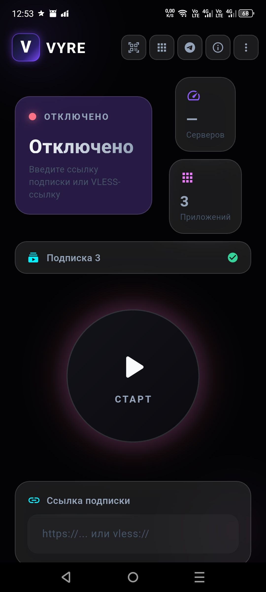
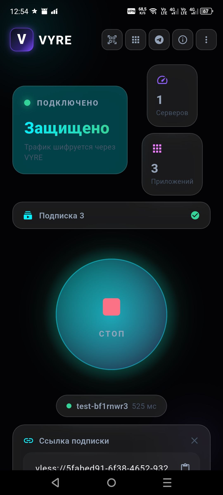

# 🛡️ VYRE Secure Access


---

# 🛡️ VYRE Secure Access

**VYRE Secure Access** — современный клиент для защищённого интернет-соединения на базе протокола VLESS с поддержкой Reality.

---

## 📸 Скриншоты

| Главный экран (отключено) | Главный экран (включено) |
|---|---|
|  |  |

---

## ✨ Особенности

- 🔒 **VLESS + Reality** — высокая производительность и скрытность
- 📱 **Split Tunneling** — выборочное использование приложений
- 📷 **QR-сканер** — быстрое подключение
- 📋 **Подписки** — добавление, удаление, переключение
- 🔄 **Автообновления** — через GitHub Releases
- 🎨 **Glassmorphism** — современный дизайн
- 🆓 **Бесплатно и без рекламы**

---

# 🛡️ VYRE Secure Access

**VYRE Secure Access** — A modern secure internet client based on the VLESS protocol with Reality support.

---

## ✨ Features

- 🔒 **VLESS + Reality protocol** — High performance and connection stealth
- 📱 **Split Tunneling** — Selective app usage
- 📷 **QR Scanner** — Fast connection via QR code
- 📋 **Subscriptions** — Add, delete, switch
- 🔄 **Auto-updates** — Via GitHub Releases
- 🎨 **Glassmorphism Design** — Modern dark interface
- 🆓 **Free and Ad-Free** — Open source project

## 📲 Installation

### 📦 Download APK

1. Go to [Releases](https://github.com/toptestsoft/vyre-mobile/releases)
2. Download the latest `app-release.apk`
3. Allow installation from unknown sources
4. Open and install the APK

### 🛠️ Build from Source

```bash
git clone https://github.com/toptestsoft/vyre-mobile.git
cd vyre-mobile
flutter pub get
flutter build apk --release
```

## 📖 Usage

1. Open the app
2. Paste your VLESS link or subscription URL
3. Press the central START button
4. Grant VPN connection permission

## 🔄 Updates
App checks for new versions on startup. Tap **"Update"** to download and install.

## 🛡️ Security & Privacy
- All traffic is encrypted
- No personal data is collected or stored
- Logs are local only

## 🤝 Contributing
See [CONTRIBUTING.md](CONTRIBUTING.md) for details.

## 📜 License
Distributed under the MIT License. See [LICENSE](LICENSE).

**Questions and suggestions:** [Issues](https://github.com/toptestsoft/vyre-mobile/issues)
