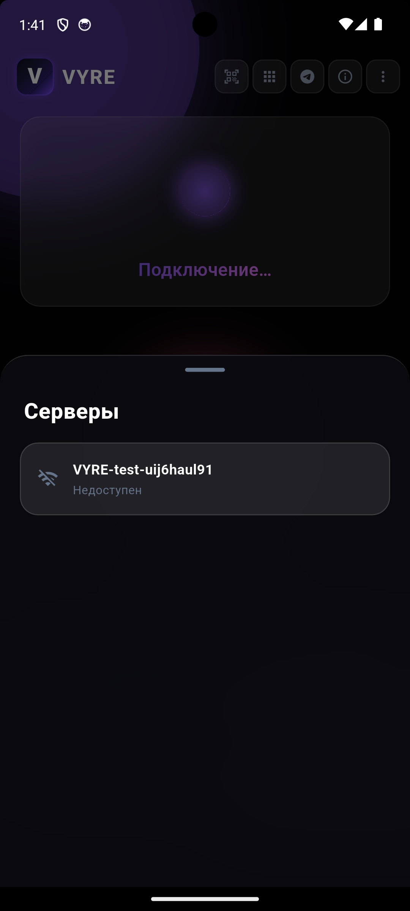
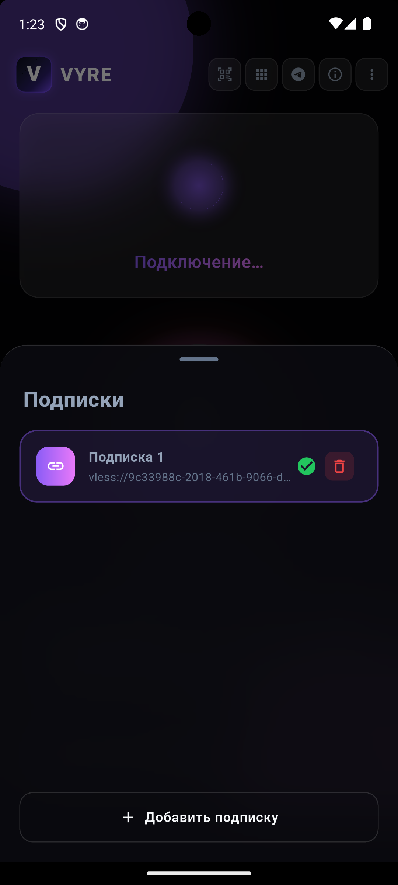
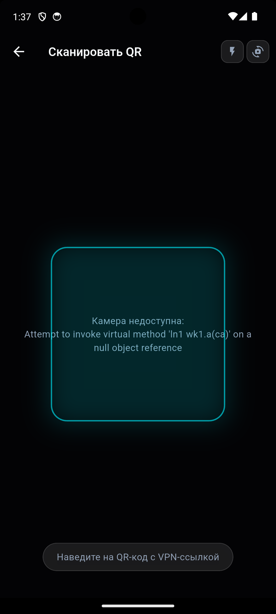

# VYRE VPN

**Безопасный, приватный и современный VPN-клиент для Android**

[](https://github.com/toptestsoft/vyre-mobile/actions/workflows/flutter-ci.yml)
[](https://github.com/toptestsoft/vyre-mobile/releases/latest)
[](./LICENSE)


---

## 📱 Скриншоты

| Главный экран | Список серверов | Подписки | QR-сканер |
|:---:|:---:|:---:|:---:|
|  |  |  |  |

## ✨ Ключевые возможности

- ⚡ **Мгновенное подключение** — автоматический выбор лучшего сервера по пингу в один тап.
- 🌍 **Мультилокация** — поддержка VLESS, VMess, Trojan, SS, Hysteria с отображением задержки.
- 🔐 **Безопасное хранение** — ключи и подписки зашифрованы через Android Keystore / iOS Keychain (`flutter_secure_storage`).
- 🔄 **Автообновление** — умная проверка обновлений через GitHub Releases API.
- 🛡️ **Zero-Log Policy** — приложение не собирает, не хранит и не передаёт никакие пользовательские данные.
- 💳 **Гибкая оплата** — интеграция с Telegram Stars и USDT (CryptoBot) через бота `VYREPayBot`.
- 📴 **Offline-first** — кэширование конфигураций для подключения без интернета.
- 🔀 **Split-tunneling** — выборочный роутинг трафика по приложениям.

## 🏗️ Архитектура

Проект построен на принципах чистой архитектуры с разделением ответственности:

| Слой | Компоненты | Описание |
|---|---|---|
| **UI** | Screens, Widgets | Cyber-glass дизайн на Material 3 |
| **State** | VpnState enum | Невозможные состояния непредставимы |
| **Services** | VpnService, SubscriptionService, UpdateService | Бизнес-логика изолирована от UI |
| **Data** | SubscriptionRepository, SubscriptionCache | Secure Storage + offline-кэш |
| **Engine** | flutter_v2ray | Xray/V2Ray core с поддержкой Reality |

### Тестирование и CI/CD
- ✅ Unit-тесты: ServerSelector, SubscriptionDecoder
- ✅ GitHub Actions: автоматический analyze + test при каждом push
- ✅ Auto-build: APK собираются автоматически при создании тега

## 🚀 Roadmap

- [x] Android (arm64, armeabi-v7a, x86_64)
- [ ] iOS
- [ ] Локализация (EN, RU, ZH)
- [ ] Sentry crash reporting
- [ ] Widget для быстрого подключения

## 📦 Установка

### Скачать APK
Перейдите в [Releases](https://github.com/toptestsoft/vyre-mobile/releases/latest) и скачайте универсальный APK:
- `app-release.apk` — подходит для всех архитектур (arm64, armeabi-v7a, x86_64)
- `VYRE-1.1.1+3-universal.apk` — именованная сборка для текущего релиза

> **Требования:** Android 7.0+ (API 24)

### Сборка из исходников

```bash
git clone https://github.com/toptestsoft/vyre-mobile.git
cd vyre-mobile
flutter pub get
flutter build apk --release

Собранный файл будет в `build/app/outputs/flutter-apk/app-release.apk` (универсальный, все архитектуры).
